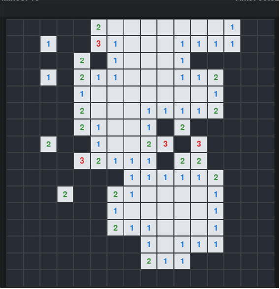
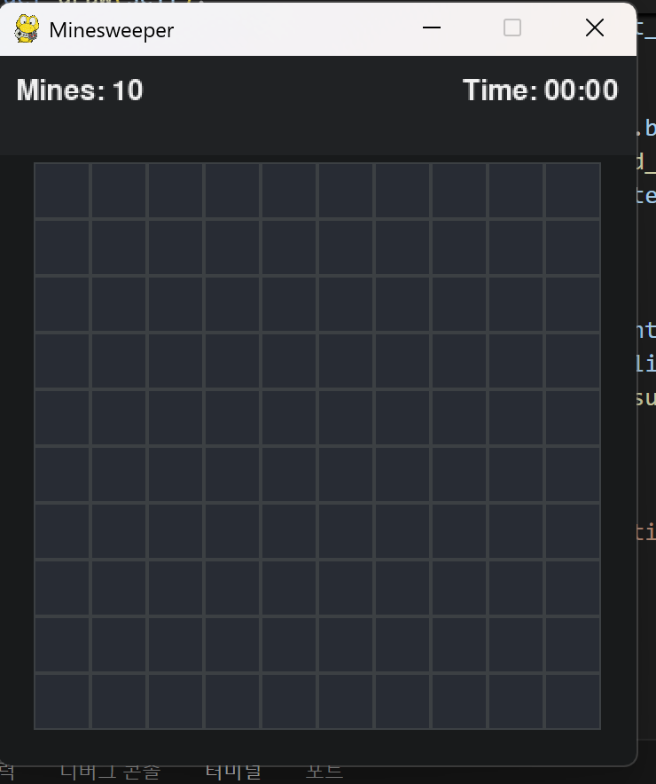
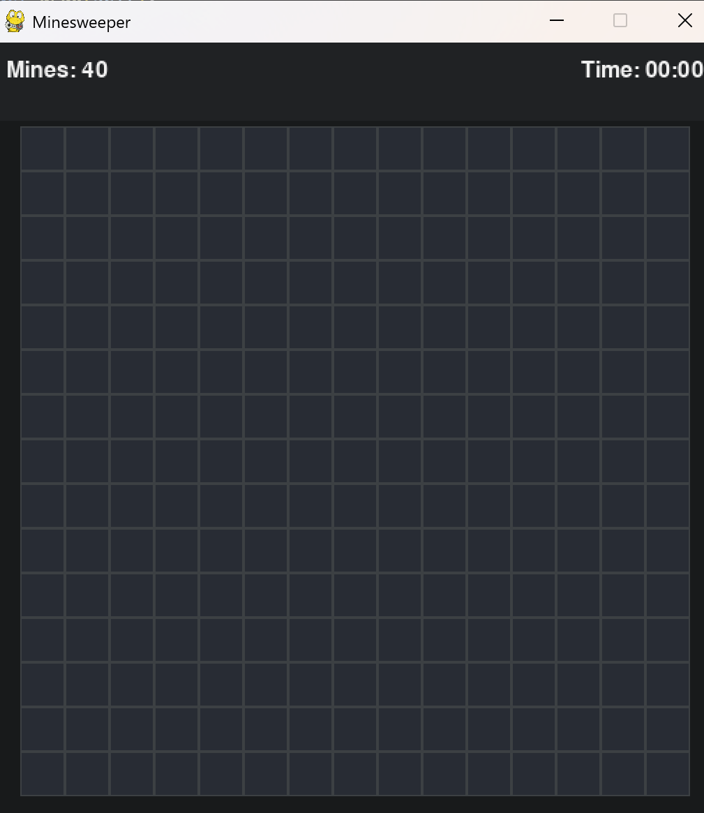
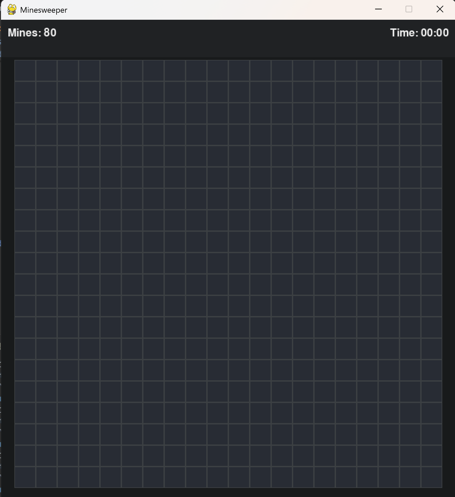
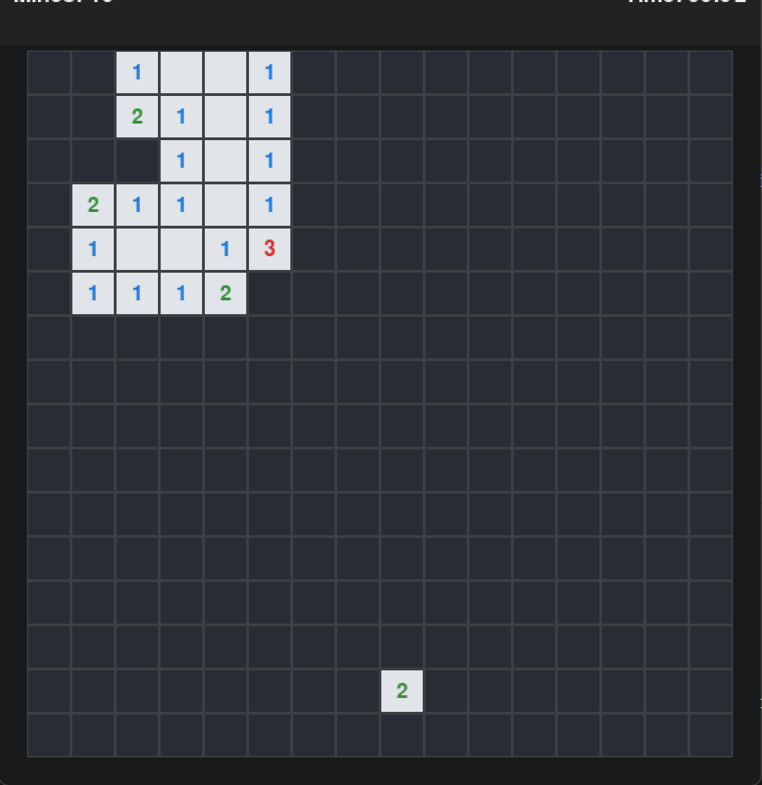
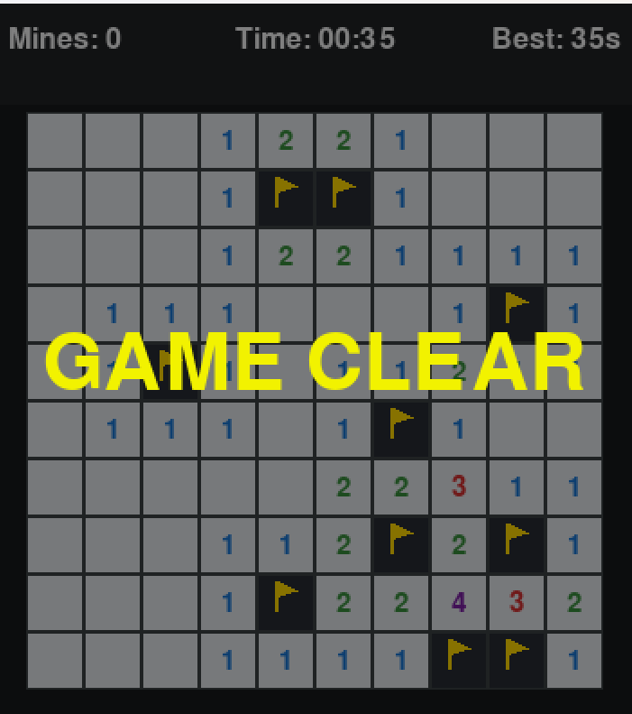
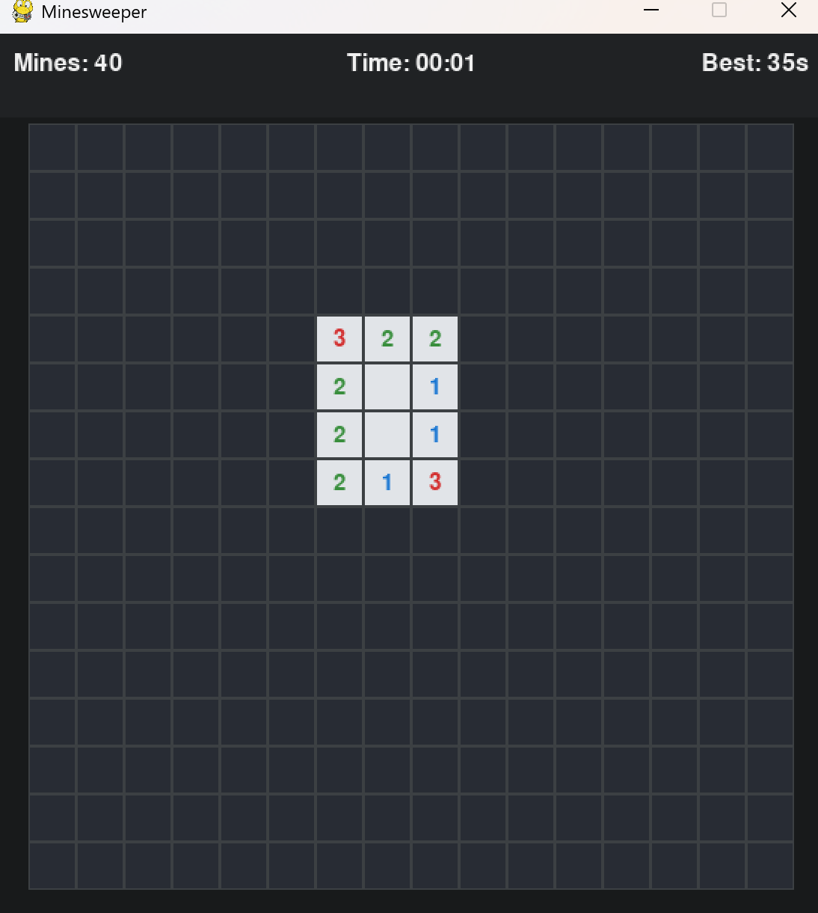
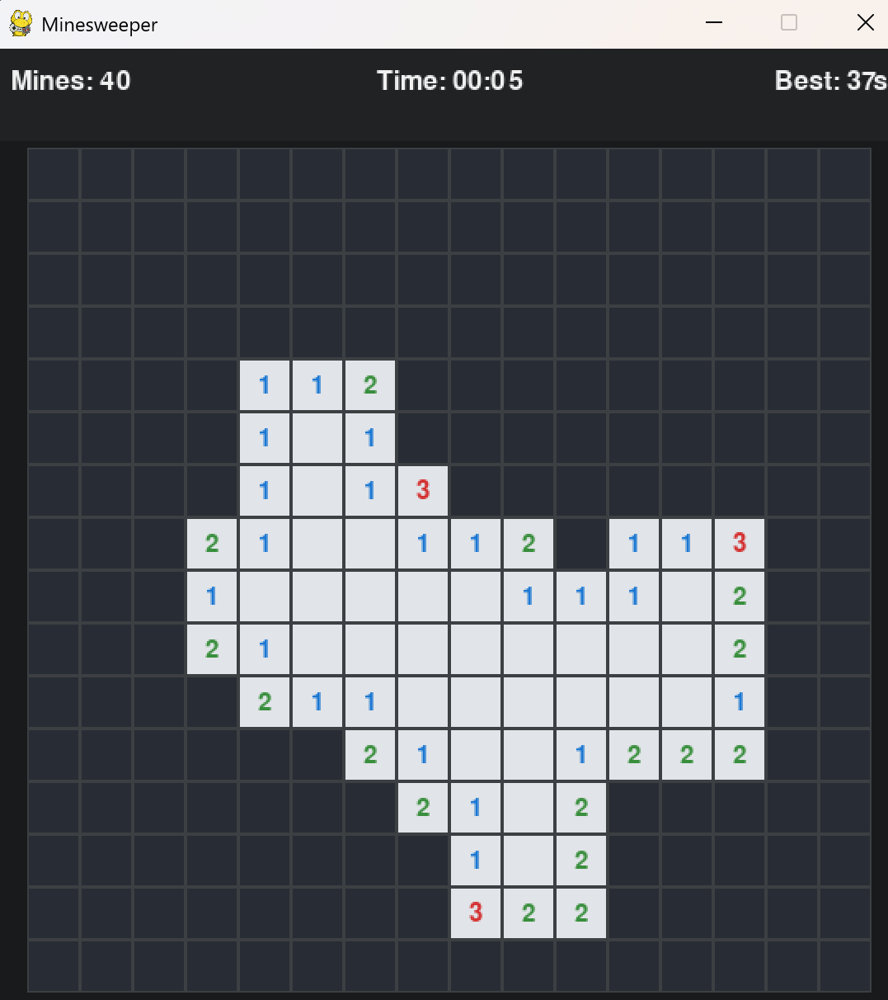
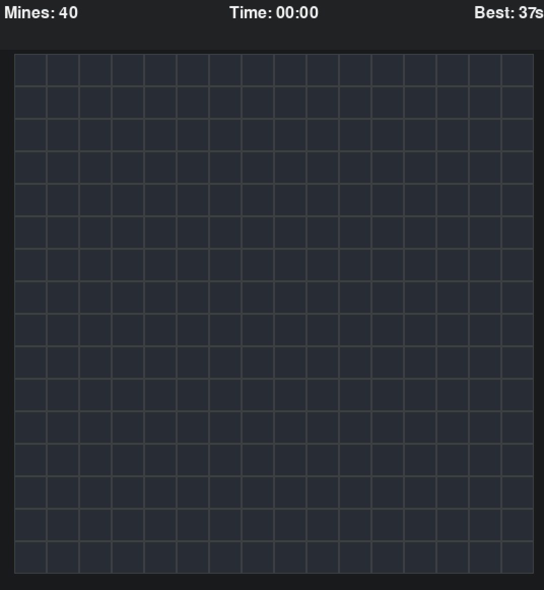

# minesweeper 오픈소스 소프트웨어 프로젝트 과제

이 프로젝트는 오픈소스 소프트웨어 과제로, 기존 지뢰 찾기 게임에 5가지 핵심 기능을 추가하여 협업을 진행한 프로젝트입니다. 

---

# 추가 구현 기능

각 기능은 이슈 생성 및 코드 리뷰를 거쳐 반영되었습니다.

#1. 숫자 색 표기
- 설명: 칸을 열었을 때 나타나는 숫자의 색을 숫자별로 다르게 지정하여 가시성을 높였습니다.

#2. 난이도 설정 기능
- 설명: 초급, 중급, 고급 등 난이도에 따라 게임 판의 크기와 지뢰의 수가 변경되도록 구현했습니다.

#3. 힌트 기능
- 설명: 지뢰가 없는 임의의 칸 하나를 확인해주는 힌트 기능을 추가했습니다.

#4. 하이 스코어 저장
- 설명: 게임 종료 시 최고 기록을 저장하고 화면에 표시합니다.

#5. 타이머 표기 및 게임 초기화
- 설명: 게임 시작 후 경과된 시간을 화면에 실시간으로 표시하며 "r"키를 누를시 게임이 초기화 됩니다.

